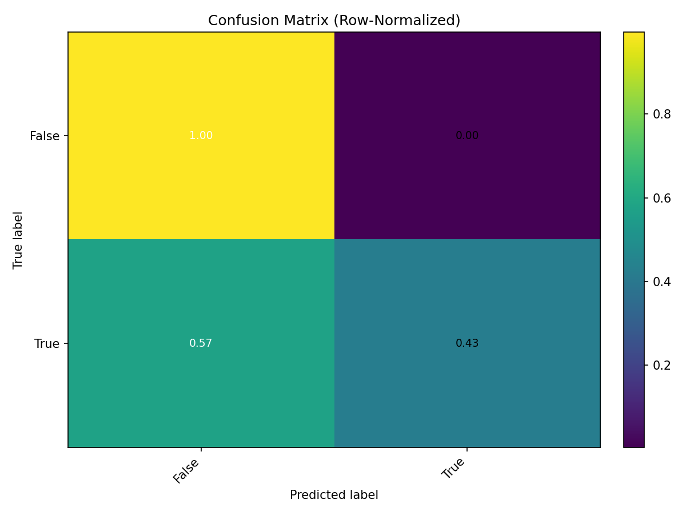

📚 MindPal – AI-Powered Study Habit Optimizer

End-to-end repo scaffolding to train, evaluate, and predict mood/emotions from mixed student logs (text + tabular) with robust preprocessing, Keras modeling, and clear visualizations.

✨ What’s inside

Robust preprocessing for numeric, categorical, datetime, and long-text columns (TF-IDF)

Auto target detection (target, label, y, class, output, else last column)

Keras feed-forward classifier (binary or multi-class auto-detected)

Saved artifacts: .h5 (model), .json + .yaml (model config), .pkl (preprocessing & label encoder)

Evaluation outputs:

accuracy.png, loss.png

confusion_matrix.png, confusion_matrix_norm.png

training_history.csv, classification_report.txt, predictions.csv

Jupyter-safe prediction CLI (predict_mood.py), with interactive fallback

📁 Folder structure (suggested)
MindPal/
├─ archive/
│  └─ data.csv                  # your dataset (features + target)
├─ train_and_eval.py            # trains model + saves graphs & reports
├─ show_results.py              # displays saved graphs & heatmaps
├─ predict_mood.py              # Jupyter-safe CLI: predict on CSV or --text
├─ requirements.txt
├─ README.md
└─ outputs/                     # (optional) if you prefer not to clutter root

In examples below we use the absolute Windows paths you provided:
C:\Users\sagni\Downloads\Mind Pal\archive\data.csv and outputs in C:\Users\sagni\Downloads\Mind Pal\

🧰 Requirements

Python 3.10–3.11

Recommended: virtual env (venv or Conda)

Packages:

tensorflow (CPU is fine; GPU optional)

numpy, pandas, scikit-learn, joblib, matplotlib, pyyaml

requirements.txt

tensorflow>=2.12
numpy>=1.23
pandas>=1.5
scikit-learn>=1.3
joblib>=1.3
matplotlib>=3.7
pyyaml>=6.0

🗂️ Data format

One CSV with all features and one target column.

The code will automatically detect the target from:
["target","label","y","class","output"] (case-sensitive) — otherwise it uses the last column.

Mixed types supported:

Numeric → impute median + standardize

Categorical (short strings) → impute mode + one-hot

Text (long strings; avg len > 40 chars) → impute empty + TF-IDF (max 5000 features per text column)

Datetime → expanded to year, month, day, dow + scaled

Missing values are handled inside the pipelines.

🚀 Quickstart
1) Create & activate environment
# (Windows - PowerShell)
python -m venv .venv
.venv\Scripts\Activate.ps1

pip install -r requirements.txt

2) Put your data

Place your dataset at:

C:\Users\sagni\Downloads\Mind Pal\archive\data.csv

3) Train + evaluate

Run the training script that:

builds the preprocessing

trains a Keras model

saves artifacts, graphs, and reports

python train_and_eval.py

Artifacts saved to:

C:\Users\sagni\Downloads\Mind Pal\
  mindpal_model.h5
  mindpal_model.json
  mindpal_model.yaml
  mindpal_preprocess.pkl
  accuracy.png
  loss.png
  confusion_matrix.png
  confusion_matrix_norm.png
  training_history.csv
  classification_report.txt
  predictions.csv

4) View graphs interactively (optional)
python show_results.py

This will display accuracy/loss curves and confusion-matrix heatmaps (recomputes test predictions to match).

5) Predict on new data or a single sentence

Jupyter-safe CLI (auto-strips Jupyter args; compiles model on load):

# Single text (no CSV needed)
python predict_mood.py --text "I felt calm and focused during revision." --print

# A CSV with the SAME feature columns used in training (target optional)
python predict_mood.py --in "C:\Users\sagni\Downloads\Mind Pal\archive\new_data.csv" --out "C:\Users\sagni\Downloads\Mind Pal\predictions_mood.csv" --print

Jupyter users can also:

%run predict_mood.py --text "A bit anxious before exams but better after studying." --print
# or simply:
%run predict_mood.py
# ...and follow the interactive prompt

🧪 What the scripts do
train_and_eval.py

Detects column types & builds a picklable ColumnTransformer.

Trains a compact MLP in Keras; handles binary or multi-class automatically.

Saves:

Model: mindpal_model.h5

Config: mindpal_model.json, mindpal_model.yaml

Preprocess bundle: mindpal_preprocess.pkl
(contains the full preprocessing pipeline, label encoder, and detected column lists)

Curves: accuracy.png, loss.png

Confusions: confusion_matrix.png (counts) and _norm.png (row-normalized)

Reports: training_history.csv, classification_report.txt

Predictions: predictions.csv (on the held-out test split)

show_results.py

Re-declares the helper transformers so the pickle can load.

Reads training_history.csv → shows accuracy & loss plots.

Recreates the 80/20 test split → predicts → shows confusion matrices.

predict_mood.py

Jupyter-safe CLI with interactive fallback:

If no --text/--in provided, it prompts you.

Loads mindpal_preprocess.pkl + mindpal_model.h5, compiles model to silence warnings.

Predicts top-1 label & probability and per-class probabilities.

Writes a tidy CSV (default: predictions_mood.csv in the output dir).

🧷 Common paths (Windows)

Data:
C:\Users\sagni\Downloads\Mind Pal\archive\data.csv

Outputs:
C:\Users\sagni\Downloads\Mind Pal\mindpal_model.h5
C:\Users\sagni\Downloads\Mind Pal\mindpal_preprocess.pkl
C:\Users\sagni\Downloads\Mind Pal\accuracy.png
C:\Users\sagni\Downloads\Mind Pal\confusion_matrix.png
…and more as listed above

🧩 Tips & troubleshooting

“Could not convert string to float” during scaling
→ You’re using the old minimal script. Use the robust one (it routes text to TF-IDF and categorical to one-hot).

IndexError in text pipeline
→ Fixed by converting the imputer’s ndarray to 1-D strings before TF-IDF (already handled in current code).

PicklingError (lambdas not picklable)
→ We removed lambdas and use top-level classes (ColumnSelector, To1DString, DateTimeExpand). Always import or re-declare them when loading the pickle.

AttributeError: Can't get attribute 'ColumnSelector' on main
→ Define the same classes in the script before joblib.load(...) (done in show_results.py and predict_mood.py).

Argparse error in Jupyter (-f ...json)
→ predict_mood.py strips Jupyter args automatically. For other scripts, wrap arg parsing or just run from terminal.

Imbalanced classes
→ Rely on classification_report.txt, the normalized confusion matrix, or add class weights in Keras if needed.

Memory with large TF-IDF
→ The pipeline stays sparse automatically; the model densifies only when feature size is modest.

🔐 Privacy & ethics

Webcam/microphone features should be opt-in only.

Store only what you need; avoid logging raw text if sensitive. Consider hashing/anonymizing user IDs.

Provide clear consent and an export/delete option for user data.

🛣️ Roadmap / nice-to-haves

 Add class weights for imbalance

 Export to ONNX for lightweight inference

 Add Flask/FastAPI microservice for predictions

 Add wandb or TensorBoard logging

 Plug in Google Calendar to adapt study schedules in real time

 Replace TF-IDF with a small sentence transformer (distil-size) + linear head
